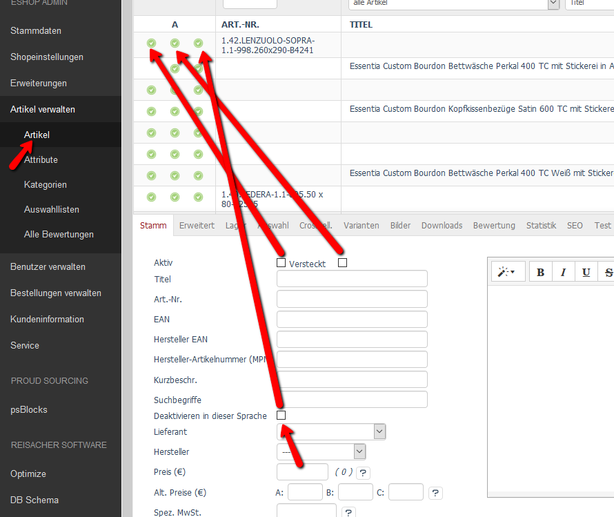
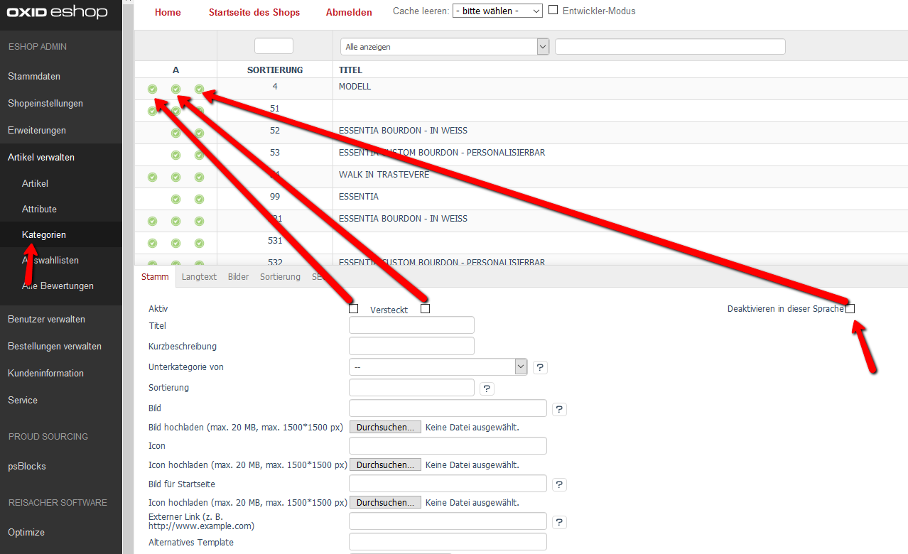

# Oxid multilang

## Description

Now you can separatly disable cateogries/products in the frontend depends on the language the user like to see.

## Install

1. Add following to composer.json on the shop root

        "autoload": {
            "psr-4": {
                "rs\\multilang\\": "./source/modules/rs/multilang"
            }
        },
    
2. Execute following sql statment:

        ALTER TABLE `oxarticles` ADD `rs_multilang_disable` TINYINT(1) NOT NULL DEFAULT '0' COMMENT 'disable the product for the main language';
        ALTER TABLE `oxarticles` ADD `rs_multilang_disable_1` TINYINT(1) NOT NULL DEFAULT '0' COMMENT 'disable the product for language id 1';
        ALTER TABLE `oxarticles` ADD `rs_multilang_disable_2` TINYINT(1) NOT NULL DEFAULT '0' COMMENT 'disable the product for language id 2';
        ALTER TABLE `oxarticles` ADD `rs_multilang_disable_3` TINYINT(1) NOT NULL DEFAULT '0' COMMENT 'disable the product for language id 3';
    
        ALTER TABLE `oxcategories` ADD `rs_multilang_disable` TINYINT(1) NOT NULL DEFAULT '0' COMMENT 'disable the product for the main language';
        ALTER TABLE `oxcategories` ADD `rs_multilang_disable_1` TINYINT(1) NOT NULL DEFAULT '0' COMMENT 'disable the product for language id 1';
        ALTER TABLE `oxcategories` ADD `rs_multilang_disable_2` TINYINT(1) NOT NULL DEFAULT '0' COMMENT 'disable the product for language id 2';
        ALTER TABLE `oxcategories` ADD `rs_multilang_disable_3` TINYINT(1) NOT NULL DEFAULT '0' COMMENT 'disable the product for language id 3';

3. Refresh autoloader files with composer.

        composer dump-autoload
        
4. Enable module in the oxid admin area, Extensions => Modules
5. Refresh views of the database and clear cache.
